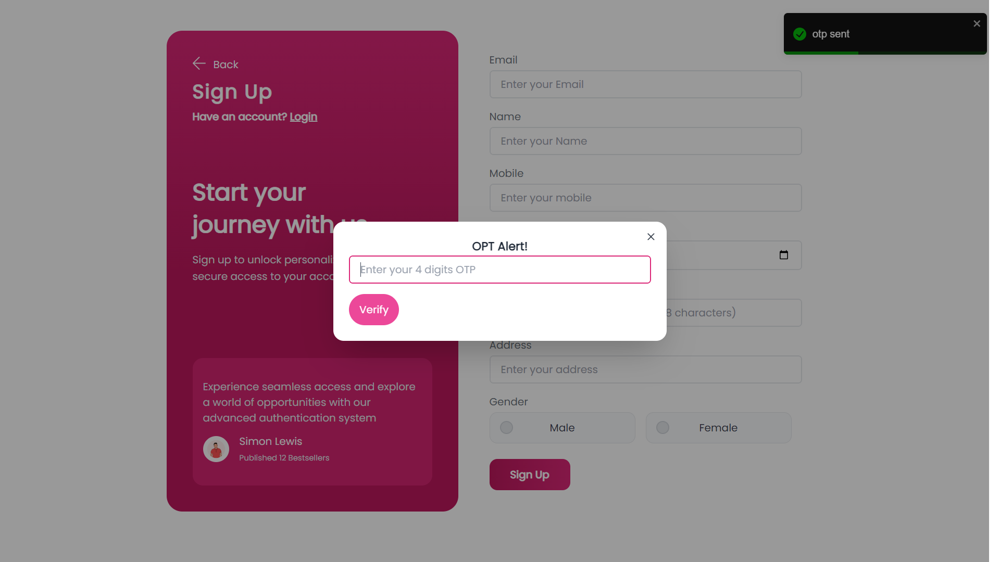

# eVitalrx Fullstack Developer Assignment

This project is a full-stack web application designed to demonstrate the skills required for a Fullstack Developer position at eVitalrx. The application provides a range of user-related functionalities, including authentication, password management, and profile updates.


## Features

- **Signup** : Allows new users to create an account using their details, with OTP verification sent via email.
- **Login** : Authenticates users with their credentials and provides a JWT token for secure session management.
- **Forgot Password** : Enables users to request a password reset link sent to their registered email.
- **Reset Password** : Allows users to securely reset their password using a OTP verification sent via email.
- **Profile Visit and Update** : Users can view and update their profile information.


## Tech Stack
### Frontend


- **React.js**: A JavaScript library for building dynamic and responsive user interfaces.

- **React Hook Form**: A library for managing form state and validation with minimal effort.

- **React Router DOM**: A routing library for navigation within the React application.

- **Tailwind CSS**: A utility-first CSS framework for styling and layout.

- **DaisyUI**: A UI component library built on Tailwind CSS for designing user interfaces.


### Backend

- **Express.j**s: A minimal and flexible Node.js web application framework for building APIs and web servers.

- **Nodemailer**: A module for sending emails, used here for sending OTPs and password reset links.

- **JWT (JSON Web Tokens)**: A method for securely transmitting information between parties, used for user authentication and session management.

- **Express Validator**: A set of middleware for validating and sanitizing user input.

- **Sequelize**: An Object-Relational Mapping (ORM) library for managing SQL databases with JavaScript.

- **Sequelize-CLI**: A command-line interface tool for Sequelize, useful for database migrations and seeding.

## Installation Instructions
### Prerequisites
- Node.js installed on your local machine.
- MySQL Workbench or any SQL platform installed.
### Clone the Repository

Install my-project with npm

```bash
 git clone https://github.com/Vaibhav0209/evital.git

```

### Frontend Setup

1.Move to the client directory

```bash
cd client

```

2.Install dependencies

```bash
yarn add

```

3.Run the frontend project:

```bash
yarn start

```

### Backend Setup

1.Move to the server directory

```bash
cd server

```

2.Install dependencies

```bash
yarn add

```

3.Run the Backend project:

```bash
yarn run dev

```

### Database Setup
1.Run database migrations

```bash
yarn sequelize-cli db:migrate
```

## API Endpoint

### Signup
- **Endpoint**: /api/signup

- **Method**: POST

- **Description**: Creates a new user account. Sends an OTP to the user's email for verification.

### Login
- **Endpoint**: /api/login

- **Method**: POST
- **Description**: Authenticates the user using email and password. Returns a JWT token upon successful login.

### Forgot Password
- **Endpoint**: /api/forgot-password

- **Method**: POST

- **Description**: Sends a password reset otp to the registered email address.

### Forgot Password
- **Endpoint**: /api/verify-otp

- **Method**: patch

- **Description**: verify the otp that sent via email

### Reset Password
- **Endpoint**: /api/change-password

- **Method**: patch

- **Description**: Allows the user to reset their password using a token provided in the password reset link.

### Profile Visit
- **Endpoint**: /api/get-user-information
- **Method**: GET 

- **Description**: Fetches user profile information 


### Profile Update
- **Endpoint**: /api/change-user-information
- **Method**: patch 

- **Description**:  and updates user details 
## Screenshots





